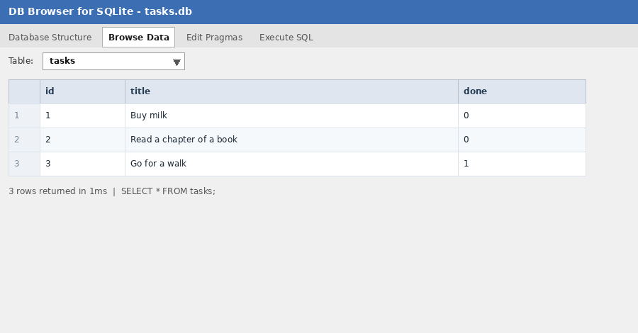

# Task Manager API — SQLite Edition

A small CRUD REST API for managing tasks, built with **Node.js + Express**.
This is Week 3 of the backend track: the in-memory task array from Assignment 1
has been replaced with a real **SQLite** database, so tasks now survive a
server restart. The API itself is unchanged — same URLs, same request bodies,
same responses. Only the storage layer changed.

```
Client  ->  Express API  ->  SQLite (tasks.db)
```

## Why SQLite?

SQLite stores the entire database in a single file (`tasks.db`) and needs **no
separate database server** to install or run. That makes it perfect for a small
project and for learning SQL: the first time the app runs it creates the file
and the table automatically. Because the API talks to the database through
plain SQL, moving to PostgreSQL or MySQL later mostly means swapping the driver,
not rewriting the endpoints.

## Where the database lives

The database file is `tasks.db`, created next to `database.js` in this folder
the first time you start the server. It is intentionally **not** committed to
git (see `.gitignore`) because it is generated automatically and is specific to
your machine.

## Getting started

Requires Node.js 18+.

```bash
cd Backend-A2-TaskManager
npm install      # installs express + better-sqlite3
npm start        # starts the server on http://localhost:3000
```

On first run you'll see `Seeded database with 3 example tasks.`
On every later run the data is loaded from `tasks.db` and is **not** re-seeded.

## Database schema

Table `tasks`:

| Column | Type    | Notes                              |
| ------ | ------- | ---------------------------------- |
| id     | INTEGER | primary key, auto-increments       |
| title  | TEXT    | required                           |
| done   | INTEGER | 0 = not done, 1 = done (boolean)   |

## API endpoints

| Method | Path         | Description            | Success | Errors |
| ------ | ------------ | ---------------------- | ------- | ------ |
| GET    | /tasks       | List all tasks         | 200     | —      |
| GET    | /tasks/:id   | Get one task           | 200     | 404    |
| POST   | /tasks       | Create a task          | 201     | 400    |
| PUT    | /tasks/:id   | Update a task          | 200     | 400, 404 |
| DELETE | /tasks/:id   | Delete a task          | 204     | 404    |

Unknown ids return `404 { "error": "Task not found" }`.
A missing/blank title returns `400 { "error": "Title is required" }`.

### Examples

```bash
# list
curl http://localhost:3000/tasks

# create
curl -X POST http://localhost:3000/tasks \
  -H "Content-Type: application/json" \
  -d '{"title":"Write SQL homework"}'

# mark done
curl -X PUT http://localhost:3000/tasks/1 \
  -H "Content-Type: application/json" \
  -d '{"done":true}'

# delete
curl -X DELETE http://localhost:3000/tasks/3
```

## Exploring the database (SQL)

Open `tasks.db` in [DB Browser for SQLite](https://sqlitebrowser.org/) and try:

```sql
SELECT * FROM tasks;                 -- list every task
SELECT * FROM tasks WHERE done = 1;  -- only completed tasks
SELECT COUNT(*) FROM tasks;          -- how many tasks
UPDATE tasks SET done = 1;           -- mark everything done
DELETE FROM tasks WHERE done = 1;    -- remove completed tasks
```

Change a row in the viewer, then call `GET /tasks` again — the API reflects the
change immediately, because the API and the viewer read the same file.

**Example query run:** `SELECT * FROM tasks WHERE done = 1;`

### Database viewer screenshot



> The screenshot above shows the three seeded rows. Replace `docs/db-screenshot.png`
> with a screenshot of your own `tasks.db` if you'd like.

## Project structure

```
Backend-A2-TaskManager/
├── server.js        # Express app + CRUD routes (SQL-backed)
├── database.js      # SQLite connection, schema, one-time seed
├── docs/
│   └── db-screenshot.png
├── package.json
└── .gitignore       # ignores node_modules/ and tasks.db
```
