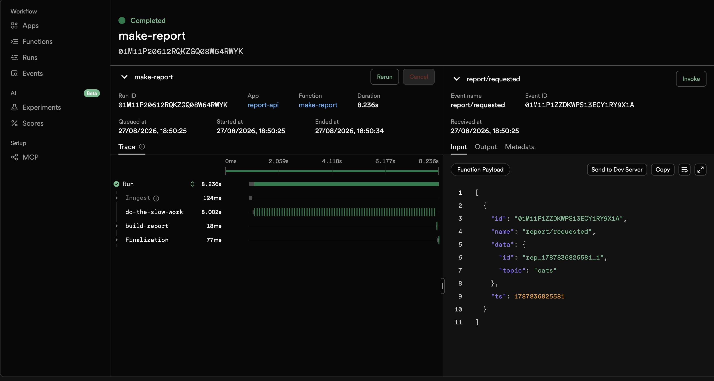
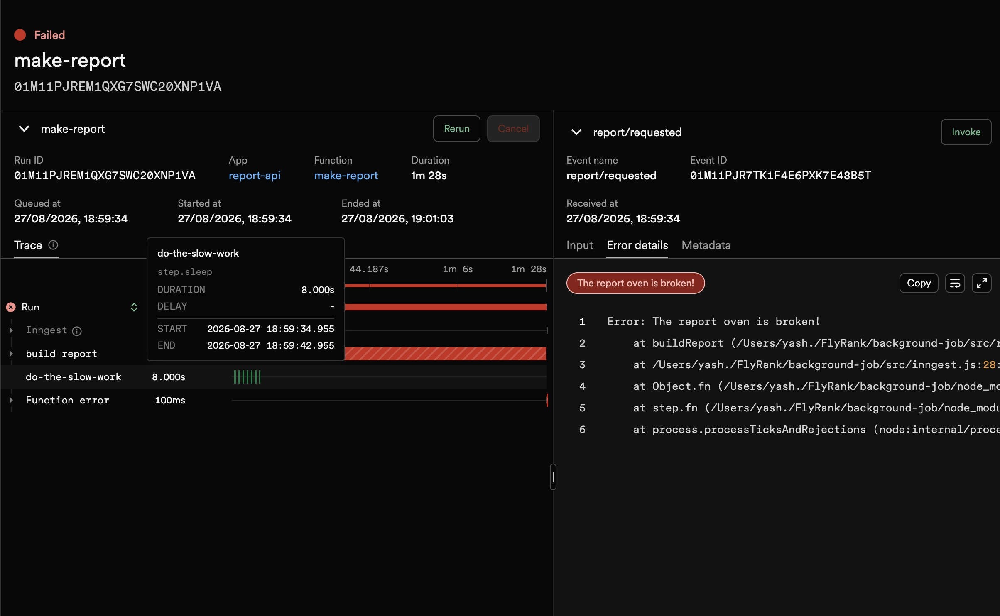
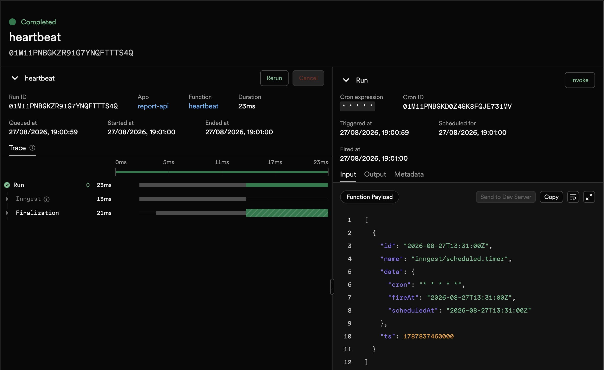

# Your First Background Job

A small API whose slow work runs **off the request**. The endpoint accepts instantly with
`202`, an Inngest worker does the 8-second job, and a status endpoint reports progress —
plus one **cron** job that runs on the clock with no request at all.

**Accept fast → work in the background → report status.** It's the pattern behind every
"we'll email you when it's ready."

## Run it (two terminals)

```bash
npm install

# terminal 1 — the API
npm start                 # http://localhost:3000

# terminal 2 — the Inngest dev server (the worker + dashboard)
npm run inngest           # = npx inngest-cli@latest dev -u http://localhost:3000/api/inngest
```

Open the dashboard at **http://localhost:8288** to watch runs, sleeps, retries, and the cron.
Runs on Node 18+ (no special flags).

## Endpoints & functions

| Endpoint | Purpose | Returns |
|----------|---------|---------|
| `GET /health` | liveness | `{ "status": "ok" }` |
| `POST /reports` `{ "topic": "cats" }` | accept the job (no slow work here) | `202 { id, status: "pending" }`; missing topic → `400` |
| `GET /reports/:id` | poll status | the report: `pending`, then `done` + result; unknown → `404` |
| `GET /reports` | control panel — all reports | array |

| Inngest function | Trigger | What it does |
|------------------|---------|--------------|
| `say-hello` | event `test/hello` | `step.sleep(5s)` → greeting (Stage 1 warm-up; Invoke from the dashboard) |
| `make-report` | event `report/requested` | `step.sleep(8s)` → `step.run` builds the result → saves `done`. `retries: 2`. Throws on topic `"fail"`. |
| `heartbeat` | cron `* * * * *` | logs a summary line: how many reports are pending / done / failed |

## Proof (202 + two polls)

```
$ time curl -i -X POST http://localhost:3000/reports \
    -H "Content-Type: application/json" -d '{"topic":"cats"}'
HTTP/1.1 202 Accepted
{"id":"rep_1756...","status":"pending"}
real  0m0.06s                      # fast, even though the work is slow

$ curl -s http://localhost:3000/reports/rep_1756...
{"id":"rep_1756...","topic":"cats","status":"pending","result":null}

# ~10 seconds later:
$ curl -s http://localhost:3000/reports/rep_1756...
{"id":"rep_1756...","topic":"cats","status":"done",
 "result":{"title":"Report about cats","summary":"...","words":642,"builtAt":"..."}}
```

## Stage 3 — bad input vs. a bad moment (why one retries and one doesn't)
A **missing topic is a bad request** — retrying it will fail forever, so it's rejected at the
door with `400` and no job is created. A **failed job** (the "oven" breaking mid-run) is a
bad *moment* — the input was valid, something transient went wrong — so Inngest retries it
with backoff (attempt 1 → 2 → 3, then `Failed`). Reject wrong input; retry wrong moments.

## Stage 4 — reading cron
- **Every day at 08:00:** `0 8 * * *`
- **Every Sunday at 22:00:** `0 22 * * 0`
- The `heartbeat` uses `* * * * *` (every minute) for a fast demo only. Servers usually run
  cron in **UTC** — check the timezone before trusting a schedule.

## Dashboard screenshots

**Event job — `make-report` completed** (8s sleep off the request, then build):



**Retries — `topic:"fail"` retried with backoff, ended Failed** (Stage 3):



**Cron — `heartbeat` fired by the schedule alone, no request** (Stage 4):



## Verification
`npm test` (7 tests) covers the routes with an injected fake Inngest: `/health`, `202` +
event sent, `400` + **no** event on missing topic, `pending → done` after the worker saves,
`404` on unknown id, and the report builder throwing on `"fail"`. The live worker + cron are
exercised with the two terminals above (the dashboard is the proof).

## Notes
- The reports store is in-memory — restarting the API forgets everything (same as A1). Try
  the durability experiment: start a report, kill the API mid-sleep, restart — the **job**
  survives in Inngest even though your server didn't have to.
