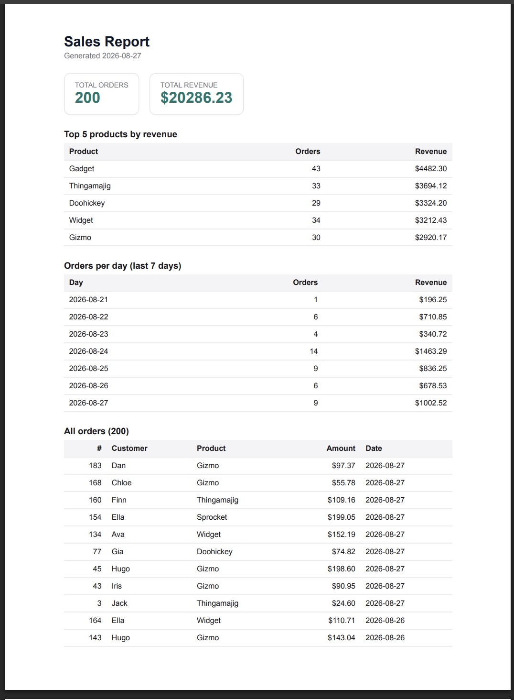

# PDF Report Generator

Query data with SQL, render it into a real **PDF report**, and hand it out by link.
The whole pipeline — **query → render → store → serve** — runs inside a plain API, exactly
as the workshop showed. Built with Express + Node's built-in `node:sqlite` + Playwright.

## Dataset
**The little shop.** A `seed` script fills `report.db` with ~200 random orders
(`customer, product, amount, created_at`). It deletes existing rows first, so running it
twice leaves exactly one clean copy of 200.

## Requirements
- Node.js 22+ (uses the built-in `node:sqlite` — the scripts pass `--experimental-sqlite`).
- Playwright's Chromium (downloaded once, free).

## Run it

```bash
npm install
npx playwright install chromium     # one-time, ~1 min

npm run seed                        # -> "Seeded 200 orders."
npm start                           # Report API on http://localhost:3000
```

> If your Node version reports the `--experimental-sqlite` flag as unknown (Node 24+ has it
> stable), remove that flag from the `scripts` in `package.json`.

### Prove the pipeline (Stage 4)

```bash
# generate (note the visible pause while it renders) -> 201 + a link
time curl -i -X POST http://localhost:3000/reports

# fetch the record
curl -s http://localhost:3000/reports/1

# download the actual PDF (bytes only travel here)
curl -o my-report.pdf http://localhost:3000/reports/1/file
open my-report.pdf                  # a real, multi-page PDF of your real data
```

### Prove idempotency (Stage 5)

```bash
curl -s -X POST http://localhost:3000/reports    # 201, id: N
curl -s -X POST http://localhost:3000/reports    # 200, SAME id: N (reused)
# reports/ gains exactly one new file. Force a fresh one:
curl -s -X POST http://localhost:3000/reports -H "Content-Type: application/json" -d '{"force":true}'
```

Standalone Stage 3 check (writes `reports/test.pdf`): `npm run report`.

## Endpoints
| Method | Path | Purpose | Response |
|--------|------|---------|----------|
| GET  | `/health` | liveness | `{ "status": "ok" }` |
| POST | `/reports` | run the pipeline (or reuse today's) | `201` new / `200` reused → `{ id, file }` |
| GET  | `/reports/:id` | the record | JSON + file link, or `404` |
| GET  | `/reports/:id/file` | download the PDF from disk | the file, or `404` |

## The aggregation SQL (Stage 2)
```sql
-- totals
SELECT COUNT(*) AS order_count, ROUND(COALESCE(SUM(amount),0),2) AS total_revenue FROM orders;

-- top 5 products by revenue
SELECT product, ROUND(SUM(amount),2) AS revenue, COUNT(*) AS orders
FROM orders GROUP BY product ORDER BY revenue DESC LIMIT 5;

-- orders per day, last 7 days
SELECT created_at AS day, COUNT(*) AS orders, ROUND(SUM(amount),2) AS revenue
FROM orders WHERE created_at >= date('now','-6 days')
GROUP BY created_at ORDER BY created_at;
```

## Store and link (the one rule)
The PDF is an **artifact**: it lives on disk in `reports/<id>.pdf`, and the database stores
only its path. Every JSON response carries the file's *address*, never its bytes — only
`GET /reports/:id/file` moves the megabytes.

## Stage 4 — when would I move this out of the request?
As soon as a report is big or many users hit it at once: rendering in-request holds an HTTP
connection open for seconds and keeps the user hostage. That's the moment to push generation
into a background job (return `202` + id immediately, render in a worker, poll status) — the
A7 pattern.

## Stage 5 — what the once-per-day check protects against, and why it matters
The check protects against **duplicate work from a double-click or a retried request**: the
same request twice produces one file and one effect, not two. A missing check like this is
exactly how a billing system emails a customer their invoice twice — or worse, charges them
twice — because a button was clicked twice or a webhook was redelivered.

## Screenshot
Page 1 of a generated report (real seeded data):



## Verification
`npm test` covers the HTML builder (both totals present, print-CSS for clean page breaks +
repeating header, correct row count, HTML-escaping of values). The seed, the four
aggregations (sane real numbers), and the once-per-day idempotency were verified against a
seeded database; the Playwright PDF step runs locally once Chromium is installed.

## Notes
- `reports/` and `report.db` are gitignored — generated artifacts and databases don't belong
  in Git; the seed script is their recipe.
